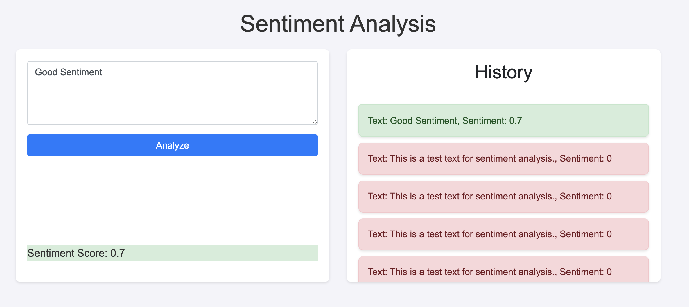
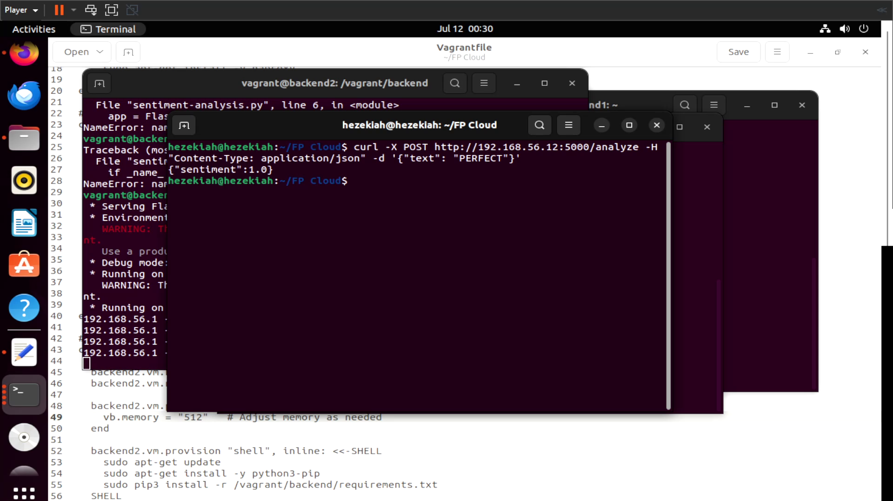
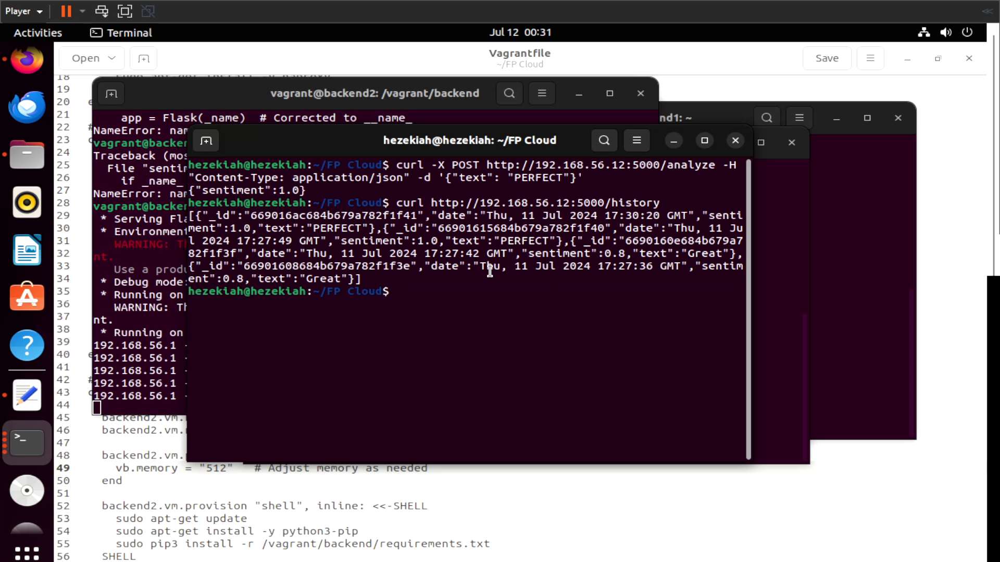

# Final-Project-Cloud-Computing-Technology-2024
## Teknologi Komputasi Awan
### Kelas A

# Permasalahan
Anda adalah seorang lulusan Teknologi Informasi, sebagai ahli IT, salah satu kemampuan yang harus dimiliki adalah Keampuan merancang, membangun, mengelola aplikasi berbasis komputer menggunakan layanan awan untuk memenuhi kebutuhan organisasi.

Pada suatu saat anda mendapatkan project untuk mendeploy sebuah aplikasi Sentiment Analysis dengan komponen Backend menggunakan python: sentiment-analysis.py dengan spesifikasi sebagai berikut

## Endpoints:
1. Analyze Text

* Endpoint: POST /analyze
* Description: This endpoint accepts a text input and returns the sentiment score of the text.
* Request:
```
{
   "text": "Your text here"
}
```
* Response:
```
{
  "sentiment": <sentiment_score>
}
```
2. Retrieve History

* Endpoint: GET /history
* Description: This endpoint retrieves the history of previously analyzed texts along with their sentiment scores.
* Response:
```
{
 {
   "text": "Your previous text here",
   "sentiment": <sentiment_score>
 },
 ...
}
```
Kemudian juga disediakan sebuah Frontend sederhana menggunakan index.html dan styles.css dengan tampilan antarmuka sebagai berikut

Kemudian anda diminta untuk mendesain arsitektur cloud yang sesuai dengan kebutuhan aplikasi tersebut. Apabila dana maksimal yang diberikan adalah 1 juta rupiah per bulan (65 US$) konfigurasi cloud terbaik seperti apa yang bisa dibuat?
## Rancangan
Pada final project saya menggunakan 3 VM dengan desain dan spesifikasi sebagai berikut


### Tabel Harga
Total saya menggunakan 3 VM. 2 VM sebagai Backend dan 1 VM sebagai Loadbalancer. Berikut untuk spesifikasi VM yang saya gunakan.
| No | Fungsi   | Nama   | Specs | Harga / bulan |
|----|--------|-------|--------|---------------|
| 1  | Load Balancer    | loadbalancer | 1vCPU, 512 MB | 4 US$         |
| 2  | App Worker    | backend1 | 1vCPU, 1 GB   | 6 US$         |
| 3  | App Worker    | backend2 | 1vCPU, 512 MB | 4 US$         |
||Total|||||15US$| 

# Implementasi
### Buat vagrantfile untuk ketiga VM
```Vagrant.configure("2") do |config|
  config.ssh.insert_key = false

  # VM for Load Balancer
  config.vm.define "loadbalancer" do |loadbalancer|
    loadbalancer.vm.box = 'ubuntu/bionic64'
    loadbalancer.vm.hostname = "loadbalancer"
    loadbalancer.vm.network :private_network, ip: "192.168.56.10"
    loadbalancer.vm.network "forwarded_port", guest: 80, host: 3000
    loadbalancer.vm.network "forwarded_port", guest: 8404, host: 8404

    loadbalancer.vm.provider "virtualbox" do |vb|
      vb.memory = "512"  # Adjust memory as needed
    end

    loadbalancer.vm.provision "shell", inline: <<-SHELL
      sudo apt-get update
      sudo apt-get install -y haproxy
    SHELL
  end

  # VM for Backend 1
  config.vm.define "backend1" do |backend1|
    backend1.vm.box = "ubuntu/bionic64"
    backend1.vm.hostname = "backend1"
    backend1.vm.network "private_network", ip: "192.168.56.11"

    backend1.vm.provider "virtualbox" do |vb|
      vb.memory = "1024"  # Adjust memory as needed
      vb.cpus = 1         # Adjust CPU cores as needed
    end

    backend1.vm.provision "shell", inline: <<-SHELL
      sudo apt-get update
      sudo apt-get install -y python3-pip mongodb
      sudo systemctl start mongodb
      sudo systemctl enable mongodb
      sudo pip3 install -r /vagrant/backend/requirements.txt
    SHELL
  end

  # VM for Backend 2
  config.vm.define "backend2" do |backend2|
    backend2.vm.box = "ubuntu/bionic64"
    backend2.vm.hostname = "backend2"
    backend2.vm.network "private_network", ip: "192.168.56.12"

    backend2.vm.provider "virtualbox" do |vb|
      vb.memory = "512"   # Adjust memory as needed
    end

    backend2.vm.provision "shell", inline: <<-SHELL
      sudo apt-get update
      sudo apt-get install -y python3-pip
      sudo pip3 install -r /vagrant/backend/requirements.txt
    SHELL
  end

  # Synced Folders
  config.vm.synced_folder "./backend", "/vagrant/backend"
  config.vm.synced_folder "./frontend", "/vagrant/frontend"
end
```

lalu ```vagrant up```

### Buat file sentiment-analysis.py
```
from flask import Flask, request, jsonify
from flask_pymongo import PyMongo
from textblob import TextBlob
from datetime import datetime

app = Flask(__name__)
app.config["MONGO_URI"] = "mongodb://localhost:27017/sentiment_analysis_db"
mongo = PyMongo(app)

@app.route('/analyze', methods=['POST'])
def analyze_sentiment():
    data = request.json
    text = data.get('text')
    if not text:
        return jsonify({'error': 'No text provided'}), 400

    analysis = TextBlob(text)
    sentiment = analysis.sentiment.polarity
    mongo.db.sentiments.insert_one({
        'text': text,
        'sentiment': sentiment,
        'date': datetime.utcnow()
    })
    return jsonify({'sentiment': sentiment}), 200

@app.route('/history', methods=['GET'])
def get_history():
    sentiments = list(mongo.db.sentiments.find().sort("date", -1))
    for sentiment in sentiments:
        sentiment['_id'] = str(sentiment['_id'])
    return jsonify(sentiments), 200

@app.route('/delete-history', methods=['POST'])
def delete_history():
    mongo.db.sentiments.delete_many({})
    return '', 204

if __name__ == '__main__':
    app.run(host='0.0.0.0', port=5000)
```

### Konfigurasi HAProxy pada Loadbalancer
```vagrant ssh loadbalancer``` lalu ```sudo nano /etc/haproxy/haproxy.cfg```
Tambahkan line berikut pada file :
```
frontend my_frontend
    bind *:80
    default_backend my_backend

backend my_backend
    balance leastconn
    server backend1 192.168.56.11:5000
    server backend2 192.168.56.12:5000
```

### Pengetesan pada sentiment-analysis.py
Jalankan sentiment-analysis.py pada salah satu backend (saya memilih backend2 sebagai contoh), lalu jalankan command berikut pada host

```curl -X POST http://192.168.56.12:5000/analyze -H "Content-Type: application/json" -d '{"text": "Great"}'```

"Great" dapat diganti dengan kata kata lainnya untuk tujuan pengetesan



Berikut history dari pengetesan yang saya lakukan yang didapat menggunakan
```curl http://192.168.56.12:5000/history```


Hal ini saya lakukan karena ada kesalahan yang membuat Loadbalancer tidak terkoneksi pada Backend

Video Demo : https://youtu.be/cLTVy1vb-uQ